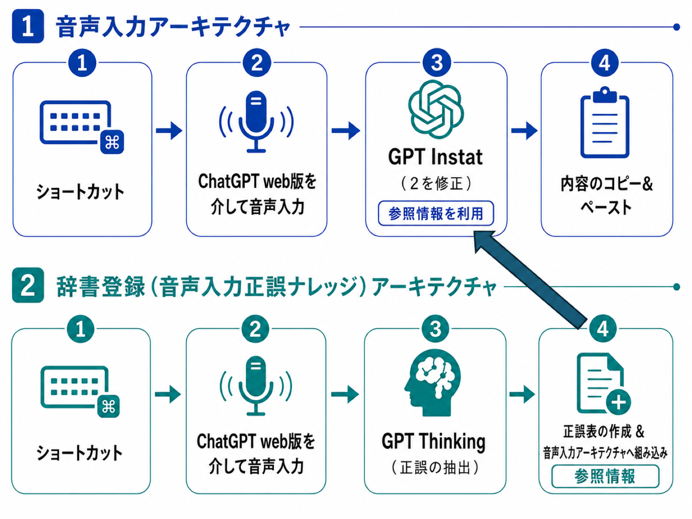

# free-super-whisper

[English](README.md) | **日本語** | [简体中文](README.zh-CN.md) | [한국어](README.ko.md)

<p align="center">
  
</p>


macOS 用の音声入力ツール。ホットキーを押して話し、もう一度押すと、清書された文章がカーソル位置に貼り付きます。文字起こし・清書には手持ちの ChatGPT(ウェブ版)をバックグラウンドの Chrome タブで自動操縦して使うため、API キーや追加課金は不要です。

## 特徴

- **どのアプリでも動く** — テキストを入力できる場所ならどこでも。`Ctrl+Z` で録音開始、もう一度押すと結果が貼り付く。作業中のウィンドウからフォーカスは奪われない。
- **文字起こしではなく清書** — 言い淀み・相槌・言い直しを除去し、明らかな誤認識だけを修正。意味・文体・語気は変えない。入力と同じ言語で出力されるため、言語を問わず使える。
- **声で育てる辞書** — 誤変換に気づいたら `Ctrl+Shift+Z` を押して「『オラクル』じゃなくて英語小文字の oracle って書いて」のように話す。`誤認識形(読み) → 正解`(例: `山田太郎(yamada tarou) → 山田汰楼`)の形で個人辞書に登録され(macOS 通知あり)、以降のすべての音声入力に反映される。読みを併記するため、例に無い表記ゆれでも**同じ音なら**正解形に直る。登録はバックグラウンドで走るので、その間も通常の音声入力を使える。固有名詞・専門用語・人名の漢字などを繰り返し使ううちに精度が上がっていく。
- **痕跡を残さない** — 処理に使った ChatGPT の会話は毎回自動でアーカイブされ、履歴に残らない。

## 仕組み

DevTools プロトコルでバックグラウンドの Chrome タブを操作し、ChatGPT 自身の音声入力ボタンで文字起こし → 専用プロジェクトで清書 → 返信をコピーして元のアプリに貼り付け、という流れを自動化しています。初回起動時に ChatGPT 上へ2つのプロジェクトが自動作成されます。



| プロジェクト | 役割 | モデル |
|---|---|---|
| Transcript Normalizer | 清書 | 最軽量(Instant) |
| Whisper Dictionary | 辞書登録ペアの抽出 | 中間(Medium) |

## インストール

```bash
./install.sh
```

流れ:

1. **ホットキーを選ぶ** — 音声入力(デフォルト `Ctrl+Z`)と辞書登録(デフォルト `Ctrl+Shift+Z`)。skhd の文法で自由に変更でき、入力は検証されます。よく使われる組み合わせ(Cmd+C など)を選ぶと警告が出ます。
2. **セットアップを任せる AI エージェントを選ぶ** — Claude Code / Codex / opencode。エージェントが決定論的な `install-core.sh`(前提チェック → 依存インストール → ChatGPT サインイン → ホットキー登録 → 許可設定の案内)を実行し、**途中でエラーが出たら [`AI-SETUP-GUIDE.md`](AI-SETUP-GUIDE.md) を読んで、最後まで自力でセットアップを完遂します**。エージェントを使わない場合は `n` を選べば `install-core.sh` がそのまま走ります。

インストール後に ChatGPT の UI 変更で動かなくなった場合も、同じガイドをエージェントに渡せば直せます(本ツールの全操作の記録と、UI が変わった際の調査・修正手順がまとめてあります)。

## 使い方

| 操作 | 動作 |
|---|---|
| `Ctrl+Z` → 話す → `Ctrl+Z` | 清書された文章がカーソル位置に貼り付く |
| `Ctrl+Shift+Z` → 修正内容を話す → `Ctrl+Shift+Z` | 「誤 → 正」が辞書に登録される |

CLI:

```bash
super-whisper voice toggle             # Ctrl+Z と同じ
super-whisper voice toggle --feedback  # Ctrl+Shift+Z と同じ
super-whisper voice --raw toggle       # 清書なしの生の文字起こし
super-whisper login                    # ChatGPT に(再)サインイン
super-whisper voice status             # 現在の状態を確認
```

## 補足

- macOS 専用(貼り付けやアプリ検出に macOS の仕組みを使用)。
- 状態はすべて `~/.super-whisper/` 配下。削除すれば完全リセット。
- ChatGPT の UI ラベルは多言語辞書で照合(英・日・簡体中・繁体中(台/香)・韓・露は実測済み。その他の言語も位置ベースのフォールバックで動作)。
- ログ: `/tmp/super-whisper-toggle.log`(辞書登録は `/tmp/super-whisper-feedback.log`)。
- 本リポジトリは [oracle](https://github.com/steipete/oracle) のコードベースそのものに、最小限の音声レイヤーを接ぎ木したものです([本家 README](README.oracle.md))。ブラウザ自動化(Chrome の起動・プロファイル・ChatGPT 操作)はすべて oracle 本家の実績あるコードです。
