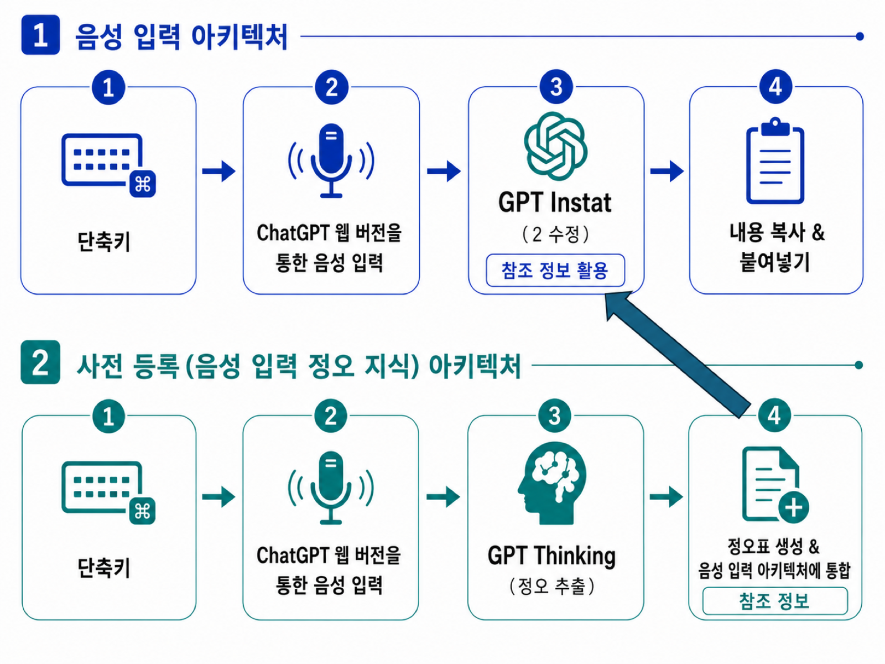

# free-super-whisper

[English](README.md) | [日本語](README.ja.md) | [简体中文](README.zh-CN.md) | **한국어**

<p align="center">
  
</p>


단축키는 두 개뿐입니다:

- **`Ctrl+Z`** — 말하면, 말한 내용이 **다듬어진 문장**이 되어 커서 위치에 붙여넣어집니다.
- **`Ctrl+Shift+Z`** — 다듬기에 오류가 있으면 **목소리로 지적**하세요. 학습되어 같은 실수를 반복하지 않습니다.

macOS 전용. 본인의 ChatGPT(웹)를 백그라운드 Chrome 탭에서 자동 조작하므로 API 키도, 추가 비용도 없습니다.

## 특징

- **어떤 앱에서든 동작** — 텍스트를 입력할 수 있는 곳이라면 어디서든. `Ctrl+Z`로 녹음 시작, 다시 누르면 결과가 붙여넣어집니다. 작업 중인 창에서 포커스를 빼앗지 않습니다.
- **전사가 아니라 다듬기** — 군말·머뭇거림·말 고침을 제거하고, 명백한 오인식만 수정합니다. 의미·어조·문체는 바꾸지 않습니다. 입력과 같은 언어로 출력되므로 어떤 언어든 사용할 수 있습니다.
- **목소리로 키우는 개인 사전** — 자꾸 잘못 인식되는 말이 있으면 `Ctrl+Shift+Z`를 누르고 "『orakuru』는 소문자 영어 oracle로 써 줘"처럼 말하세요. `오인식(읽기) → 정답` 형태(예: `山田太郎(yamada tarou) → 山田汰楼`)로 사전에 등록되고(macOS 알림), 이후 모든 음성 입력에 반영됩니다. 읽기를 함께 저장하므로 **같은 소리의 다른 표기**도 수정됩니다. 등록은 백그라운드에서 진행되어 그동안에도 계속 음성 입력을 쓸 수 있습니다.
- **흔적을 남기지 않음** — 처리에 사용한 ChatGPT 대화는 매번 자동으로 보관(아카이브)되어 기록에 남지 않습니다.

## 동작 원리

DevTools 프로토콜로 백그라운드 Chrome 탭을 조작합니다: ChatGPT의 받아쓰기 버튼으로 전사 → 전용 프로젝트에서 다듬기 → 답변을 복사해 원래 앱에 붙여넣기. 첫 실행 시 ChatGPT에 프로젝트 두 개가 자동 생성됩니다.



| 프로젝트 | 역할 | 모델 |
|---|---|---|
| Transcript Normalizer | 다듬기 | 가장 가벼움(즉시) |
| Whisper Dictionary | 사전 항목 추출 | 중간(중간) |

## 설치

```bash
./install.sh
```

과정:

1. **단축키 선택** — 음성 입력(기본 `Ctrl+Z`)과 사전 등록(기본 `Ctrl+Shift+Z`). skhd 문법으로 자유롭게 바꿀 수 있고 입력은 검증됩니다. 자주 쓰이는 조합(Cmd+C 등)을 고르면 경고가 나옵니다.
2. **설치를 맡길 AI 에이전트 선택** — Claude Code / Codex / opencode. 에이전트가 결정론적 스크립트 `install-core.sh`(사전 요건 확인 → 의존성 설치 → ChatGPT 로그인 → 단축키 등록 → 권한 안내)를 실행하고, **중간에 오류가 나면 [`AI-SETUP-GUIDE.md`](AI-SETUP-GUIDE.md)를 읽고 끝까지 스스로 설치를 완료합니다**. 에이전트 없이 하려면 `n`을 선택하면 `install-core.sh`가 바로 실행됩니다.

설치 후 ChatGPT UI 변경으로 동작하지 않게 되어도, 같은 가이드를 에이전트에게 주면 고칠 수 있습니다(도구의 모든 조작 기록과 UI 변경 시의 조사·수정 방법이 담겨 있습니다).

## 사용법

| 조작 | 동작 |
|---|---|
| `Ctrl+Z` → 말하기 → `Ctrl+Z` | 다듬어진 문장이 커서 위치에 붙여넣어짐 |

> 참고: 재부팅 후 등 첫 번째 누름만 조금 오래 걸립니다(백그라운드 Chrome을 시작하기 때문). 이후에는 탭이 준비된 상태로 유지되어 몇 초 안에 녹음이 시작됩니다.
| `Ctrl+Shift+Z` → 수정 내용 말하기 → `Ctrl+Shift+Z` | 「오인식 → 정답」이 사전에 등록됨 |

CLI:

```bash
super-whisper voice toggle             # Ctrl+Z와 동일
super-whisper voice toggle --feedback  # Ctrl+Shift+Z와 동일
super-whisper voice --raw toggle       # 다듬기 없는 원문 전사
super-whisper login                    # ChatGPT(재)로그인
super-whisper voice status             # 현재 상태 확인
```

## 설정

`~/.super-whisper/config.json`(첫 실행 시 자동 생성):

```json
{
  "dictationModel": "instant",
  "dictionaryModel": "thinking"
}
```

- `dictationModel` — `Ctrl+Z`(다듬기)에 사용하는 모델 티어. 기본값은 가장 빠른 `instant`.
- `dictionaryModel` — `Ctrl+Shift+Z`(사전 추출)에 사용하는 모델 티어. 기본값은 중간의 `thinking`.
- 사용 가능한 값: `instant` / `thinking` / `medium` / `high` / `extra-high` / `pro`(모델 선택기의 원시 라벨도 가능). 일회성 변경: `super-whisper voice toggle --model high`.
- `browserPath` — 시스템 Chrome 대신 사용할 Chromium 계열 브라우저(Edge / Brave / Chromium / Arc 등)의 바이너리 경로. Safari / Firefox는 지원하지 않습니다(DevTools 프로토콜로 브라우저를 구동하기 때문).

두 프롬프트와 사전도 로컬 일반 파일입니다. 편집 후 명령 하나로 반영됩니다:

```
~/.super-whisper/prompts/normalizer.md            # Ctrl+Z 다듬기 프롬프트
~/.super-whisper/prompts/dictionary-extractor.md  # Ctrl+Shift+Z 추출 프롬프트
~/.super-whisper/dictionary.txt                   # 한 줄에 하나 「오인식(읽기) → 정답」
```

```bash
super-whisper sync   # 로컬 파일 내용으로 ChatGPT의 두 프로젝트를 다시 씀
```

Ctrl+Shift+Z 등록도 먼저 `dictionary.txt`에 기록한 뒤 푸시하므로 로컬과 ChatGPT가 어긋나지 않습니다.

## 참고

- macOS 전용(붙여넣기·앱 감지에 macOS 기능 사용).
- 모든 상태는 `~/.super-whisper/` 아래에 있으며, 삭제하면 완전 초기화됩니다.
- ChatGPT UI 라벨은 다국어 사전으로 매칭 — 영어·일본어·중국어 간체·번체(대만/홍콩)·한국어·러시아어는 실측 검증됨, 그 외 언어는 위치 기반 폴백으로 동작합니다.
- 로그: `/tmp/super-whisper-toggle.log`(사전: `/tmp/super-whisper-feedback.log`).
- 이 저장소는 [oracle](https://github.com/steipete/oracle) 코드베이스 위에 최소한의 음성 레이어를 얹은 것입니다([업스트림 README](README.oracle.md)). 모든 브라우저 자동화는 oracle의 검증된 코드입니다.
## 감사의 말

이 프로젝트는 [Peter Steinberger](https://github.com/steipete)의
[**oracle**](https://github.com/steipete/oracle) 위에 서 있습니다. 이 도구의
어려운 부분 전부 — Chrome 실행과 관리, 로그인 유지 프로필, 쿠키 처리,
ChatGPT 페이지 자동화, 프로필 잠금 — 는 oracle의 코드이고, 우리는 그 위에
얇은 음성 입력 레이어를 더했을 뿐입니다. 이 도구가 안정적이라면 그 안정성은
물려받은 것입니다. 감사합니다.

MIT 라이선스([LICENSE](LICENSE)): oracle © Peter Steinberger,
음성 레이어 © yukimaru77.
