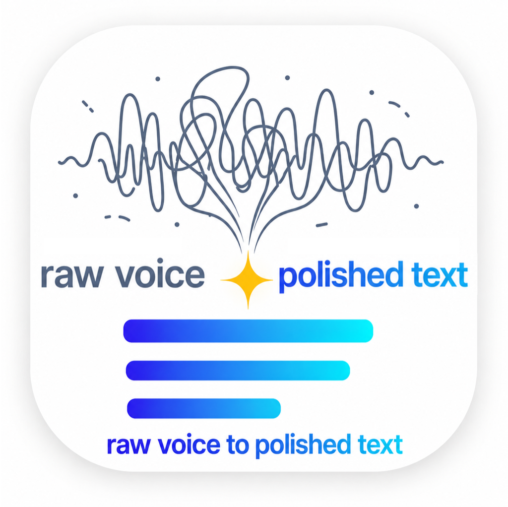
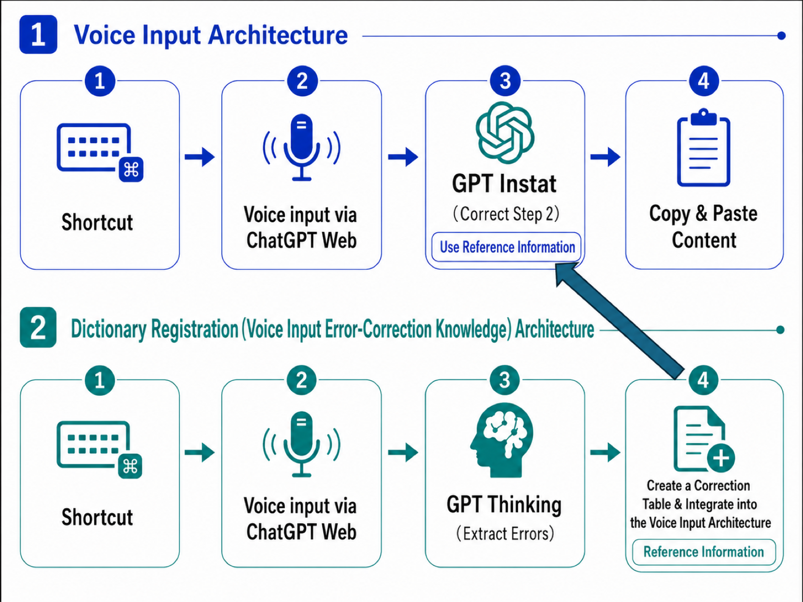

# free-super-whisper

**English** | [日本語](README.ja.md) | [简体中文](README.zh-CN.md) | [한국어](README.ko.md)

<p align="center">
  
</p>


Two hotkeys:

- **`Ctrl+Z`** — speak, and a **polished written version** of what you said is pasted at your cursor.
- **`Ctrl+Shift+Z`** — when the cleanup got something wrong, **say the correction** — it is learned and never repeated.

macOS only. Free: it drives your own ChatGPT (web) in a background Chrome tab — no API keys, no extra costs.

## Features

- **Works in any app** — anywhere you can type. `Ctrl+Z` starts recording, pressing it again pastes the result. Focus never leaves the window you are working in.
- **Polished writing, not raw transcription** — fillers, hesitations, and false starts are removed; only obvious misrecognitions are fixed. Meaning, tone, and register are preserved. Output is in the same language as the input, so it works in any language.
- **A personal dictionary you grow by voice** — when something keeps getting misheard, press `Ctrl+Shift+Z` and say, e.g., *"write 'orakuru' as lowercase English oracle"*. The correction is stored as `wrong(reading) → correct` (e.g. `山田太郎(yamada tarou) → 山田汰楼`) with a macOS notification, and applies to every future dictation. Because the reading is stored too, **any other transcription of the same sound** gets fixed as well. Registration runs in the background, so you can keep dictating meanwhile. Names, jargon, and personal spellings get better the more you use it.
- **Leaves no trace** — the throwaway ChatGPT conversation is archived out of your history after every use.

## How it works

A background Chrome tab is driven over the DevTools protocol: ChatGPT's own dictation button transcribes your speech → a dedicated project cleans it up → the reply is copied and pasted back into the app you were in. Two ChatGPT projects are created automatically on first run.



| Project | Role | Model |
|---|---|---|
| Transcript Normalizer | Cleanup | Lightest (Instant) |
| Whisper Dictionary | Extracting dictionary pairs | Middle (Medium) |

## Install

```bash
./install.sh
```

The flow:

1. **Pick your hotkeys** — dictation (default `Ctrl+Z`) and dictionary feedback (default `Ctrl+Shift+Z`). Free-form skhd syntax is accepted and validated; combos that clash with common shortcuts (like Cmd+C) get a warning.
2. **Pick an AI agent to run the setup** — Claude Code / Codex / opencode. The agent runs the deterministic `install-core.sh` (prerequisites → dependencies → ChatGPT sign-in → hotkeys → permission guidance), and **if anything fails it reads [`AI-SETUP-GUIDE.md`](AI-SETUP-GUIDE.md) and finishes the setup on its own**. No agent? Choose `n` and `install-core.sh` runs directly.

If the tool later breaks because ChatGPT's UI changed, hand the same guide to an agent — it contains a record of every operation this tool performs and the probe-and-patch method for adapting to UI drift.

## Usage

| Action | Result |
|---|---|
| `Ctrl+Z` → speak → `Ctrl+Z` | Polished text is pasted at your cursor |

> Note: only the first press after a reboot takes a little longer (it launches the background Chrome). After that the tab stays warm and recording starts in a couple of seconds.
| `Ctrl+Shift+Z` → describe a correction → `Ctrl+Shift+Z` | `wrong → correct` is added to your dictionary |

CLI:

```bash
super-whisper voice toggle             # same as Ctrl+Z
super-whisper voice toggle --feedback  # same as Ctrl+Shift+Z
super-whisper voice --raw toggle       # raw transcript, no cleanup
super-whisper login                    # (re-)sign in to ChatGPT
super-whisper voice status             # current session state
```

## Configuration

`~/.super-whisper/config.json` (created automatically on first run):

```json
{
  "dictationModel": "instant",
  "dictionaryModel": "thinking"
}
```

- `dictationModel` — model tier for the `Ctrl+Z` cleanup (default: the fastest, `instant`).
- `dictionaryModel` — model tier for the `Ctrl+Shift+Z` correction extraction (default: `thinking`, the mid tier).
- Accepted values: `instant` / `thinking` / `medium` / `high` / `extra-high` / `pro` (or any raw label from the model picker). One-off override: `super-whisper voice toggle --model high`.

## Notes

- macOS only (paste-back and app detection use macOS facilities).
- All state lives under `~/.super-whisper/`. Delete it for a full reset.
- ChatGPT UI labels are matched via a multilingual dictionary — live-verified for English, Japanese, Simplified Chinese, Traditional Chinese (TW/HK), Korean, and Russian, with position-based fallbacks for other locales.
- Logs: `/tmp/super-whisper-toggle.log` (dictionary: `/tmp/super-whisper-feedback.log`).
- Built directly on top of [oracle](https://github.com/steipete/oracle) — this repo is the oracle codebase with a minimal voice layer grafted on ([upstream README](README.oracle.md)). All browser automation (Chrome lifecycle, profiles, ChatGPT page actions) is oracle's own, battle-tested code.
## Acknowledgements

This project stands on [**oracle**](https://github.com/steipete/oracle) by
[Peter Steinberger](https://github.com/steipete). Everything hard in here —
launching and managing Chrome, persistent signed-in profiles, cookie
handling, the ChatGPT page automation, profile locking — is oracle's code,
not ours. We added a thin voice-dictation layer on top. If this tool is
reliable, that reliability is inherited. Thank you.

Licensed under MIT (see [LICENSE](LICENSE)): oracle © Peter Steinberger,
voice layer © yukimaru77.
