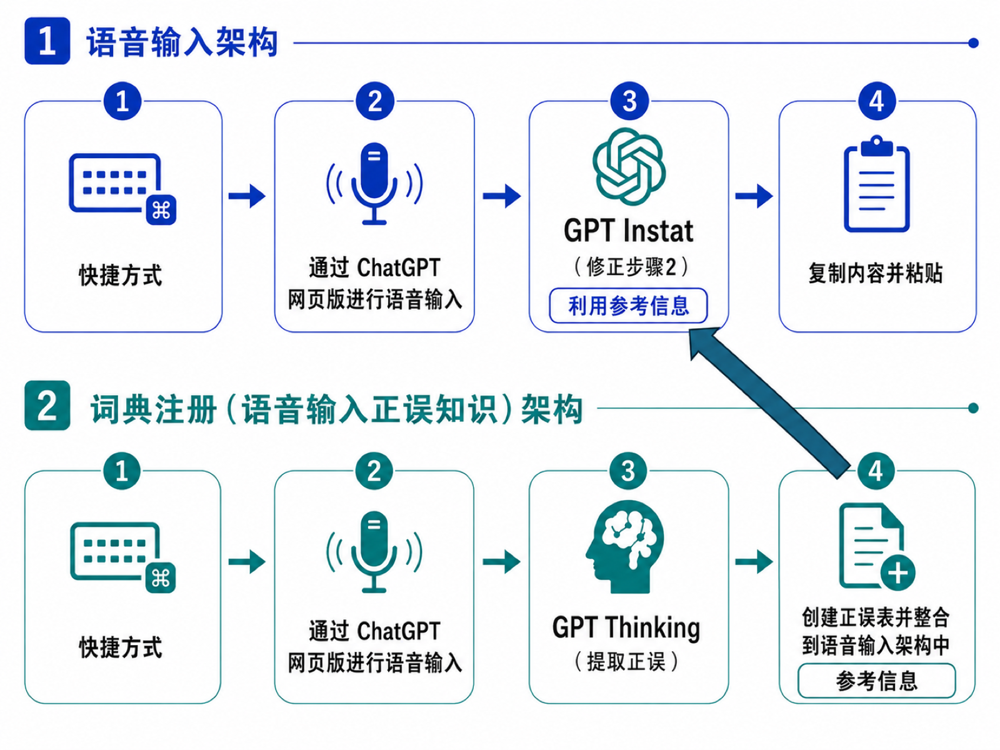

# free-super-whisper

[English](README.md) | [日本語](README.ja.md) | **简体中文** | [한국어](README.ko.md)

<p align="center">
  
</p>


只有两个快捷键:

- **`Ctrl+Z`** — 说话,你的口语会变成**润色好的书面文字**,粘贴到光标位置。
- **`Ctrl+Shift+Z`** — 润色出错时,**用声音指出错误**——它会被学习,以后不再犯。

仅支持 macOS。免费:在后台 Chrome 标签页中操控你自己的 ChatGPT(网页版),无需 API 密钥,也没有额外费用。

## 特性

- **任何应用都能用** — 只要能输入文字的地方都可以。`Ctrl+Z` 开始录音,再按一次即粘贴结果。焦点始终不会离开你正在使用的窗口。
- **不是转写,而是润色** — 去除口头语、停顿和改口,只修正明显的误识别。不改变意思、语气和文风。输出语言与输入一致,任何语言都适用。
- **用声音养成的个人词典** — 发现某个词总被听错时,按 `Ctrl+Shift+Z` 说出修正,例如"『orakuru』请写成小写英文 oracle"。修正会以 `误识别(读音) → 正确` 的形式登记(如 `山田太郎(yamada tarou) → 山田汰楼`,macOS 通知确认),并应用到之后的所有语音输入。因为同时记录了读音,**同一发音的其他误写**也会被修正。登记在后台进行,期间可以继续正常使用语音输入。
- **不留痕迹** — 每次使用后,处理用的 ChatGPT 会话都会自动归档,不留在历史记录中。

## 工作原理

通过 DevTools 协议操控后台 Chrome 标签页:用 ChatGPT 自带的听写按钮转写 → 在专用项目中润色 → 复制回复并粘贴回原来的应用。首次运行时会在 ChatGPT 上自动创建两个项目。



| 项目 | 角色 | 模型 |
|---|---|---|
| Transcript Normalizer | 润色 | 最轻量(极速) |
| Whisper Dictionary | 提取词典条目 | 中等(均衡) |

## 安装

```bash
./install.sh
```

流程:

1. **选择快捷键** — 语音输入(默认 `Ctrl+Z`)和词典登记(默认 `Ctrl+Shift+Z`)。接受 skhd 语法并做校验;选择与常用快捷键(如 Cmd+C)冲突的组合会收到警告。
2. **选择负责安装的 AI 代理** — Claude Code / Codex / opencode。代理会运行确定性的 `install-core.sh`(前提检查 → 安装依赖 → 登录 ChatGPT → 注册快捷键 → 权限指引),**如果中途出错,会阅读 [`AI-SETUP-GUIDE.md`](AI-SETUP-GUIDE.md) 并自行完成全部安装**。不用代理的话选 `n`,直接运行 `install-core.sh`。

安装后如果因 ChatGPT 界面变化而失效,把同一份指南交给代理即可修复(其中记录了本工具的全部操作,以及界面变化时的排查修复方法)。

## 使用

| 操作 | 效果 |
|---|---|
| `Ctrl+Z` → 说话 → `Ctrl+Z` | 润色后的文字粘贴到光标位置 |

> 注意:只有第一次按下(如重启后,需要启动后台 Chrome)会稍慢一些。之后标签页保持热备状态,几秒内即可开始录音。
| `Ctrl+Shift+Z` → 说出修正 → `Ctrl+Shift+Z` | 「误 → 正」登记到词典 |

CLI:

```bash
super-whisper voice toggle             # 等同 Ctrl+Z
super-whisper voice toggle --feedback  # 等同 Ctrl+Shift+Z
super-whisper voice --raw toggle       # 原始转写,不润色
super-whisper login                    # (重新)登录 ChatGPT
super-whisper voice status             # 查看当前状态
```

## 配置

`~/.super-whisper/config.json`(首次运行时自动生成):

```json
{
  "dictationModel": "instant",
  "dictionaryModel": "thinking"
}
```

- `dictationModel` — `Ctrl+Z`(润色)使用的模型档位,默认最快的 `instant`。
- `dictionaryModel` — `Ctrl+Shift+Z`(词典提取)使用的模型档位,默认中档的 `thinking`。
- 可用值:`instant` / `thinking` / `medium` / `high` / `extra-high` / `pro`(也可填写模型选择器中的原始标签)。临时覆盖:`super-whisper voice toggle --model high`。
- `browserPath` — 用来代替系统 Chrome 的 Chromium 系浏览器(Edge / Brave / Chromium / Arc 等)的二进制路径。不支持 Safari / Firefox(工具通过 DevTools 协议驱动浏览器)。

两个提示词和你的词典也是本地纯文本文件——编辑后一条命令即可推送:

```
~/.super-whisper/prompts/normalizer.md            # Ctrl+Z 润色提示词
~/.super-whisper/prompts/dictionary-extractor.md  # Ctrl+Shift+Z 提取提示词
~/.super-whisper/dictionary.txt                   # 每行一条「误(读音) → 正确」
```

```bash
super-whisper sync   # 用本地文件重写两个 ChatGPT 项目
```

Ctrl+Shift+Z 也会先写入 `dictionary.txt` 再推送,本地与 ChatGPT 永不偏离。

## 备注

- 仅支持 macOS(粘贴与应用检测使用 macOS 机制)。
- 所有状态位于 `~/.super-whisper/`,删除即完全重置。
- ChatGPT 界面标签通过多语言词典匹配 — 英语、日语、简体中文、繁体中文(台/港)、韩语、俄语均经实测,其他语言有基于位置的回退方案。
- 日志:`/tmp/super-whisper-toggle.log`(词典:`/tmp/super-whisper-feedback.log`)。
- 本仓库直接构建在 [oracle](https://github.com/steipete/oracle) 之上 — 即 oracle 代码库加上一层最小的语音功能([上游 README](README.oracle.md))。所有浏览器自动化均为 oracle 久经考验的原生代码。
## 致谢

本项目建立在 [Peter Steinberger](https://github.com/steipete) 的
[**oracle**](https://github.com/steipete/oracle) 之上。这个工具里所有困难的
部分——Chrome 的启动与管理、持久登录配置文件、Cookie 处理、ChatGPT 页面
自动化、配置文件锁——都是 oracle 的代码;我们只是在其上添加了一层轻薄的
语音输入层。如果这个工具足够可靠,那份可靠是继承来的。谢谢。

MIT 许可([LICENSE](LICENSE)):oracle © Peter Steinberger,
语音层 © yukimaru77。
